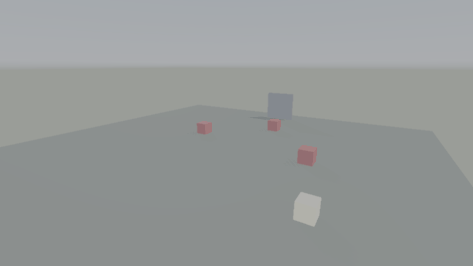

# Action Slice



A complete small third-person action game, and the reference demo for the
Game3D action tier (ADRs 0074–0100). Everything the tier ships is used in
anger here, in about 700 readable lines across three files:

| System | Where |
|--------|-------|
| `GameBase3D`/`IScene3D` shell (menu → arena → victory, fade transitions) | `main.zia` |
| `ThirdPersonController` + `CharacterController3D` spring-arm movement | `arena.zia` |
| Melee combat: `Hitbox3D` swing windows, `HitEvent3D`, `Health3D`, despawn on death | `arena.zia` |
| `TargetLock3D` lock-on (TAB) | `arena.zia` |
| `Interactable3D`/`Interactor3D` door + healing chest (E) | `arena.zia` |
| `Sky3D` + `TimeOfDay3D` procedural day/night | `arena.zia` |
| `Minimap3D` with tracked player, compass markers, objective indicator | `arena.zia` |
| `Footsteps3D` + `SurfaceTable3D` over a surface-tagged floor | `arena.zia` |
| Persistence: `SetPersistent`, cell flags, `SaveState`/`LoadState` (F5/F9) | `arena.zia`, `main.zia` |
| Pause (`World3D.IsPaused`), HUD overlay text/bars | `main.zia` |

## Run

```sh
zanna run examples/3d/action_slice/main.zia
```

Controls: WASD + mouse to move, SPACE swings, TAB toggles lock-on, E
interacts, P pauses, F5/F9 save/load, ESC returns to the menu. Defeat the
three red crates to clear the arena.

## Probe

`test.zia` drives the same `Arena` module deterministically (no window
input) and asserts the combat, interaction, footsteps, day/night, and
save/load flows. Registered as CTest `g3d_action_slice_probe`.

```sh
ZANNA_3D_BACKEND=software zanna run examples/3d/action_slice/test.zia
```
